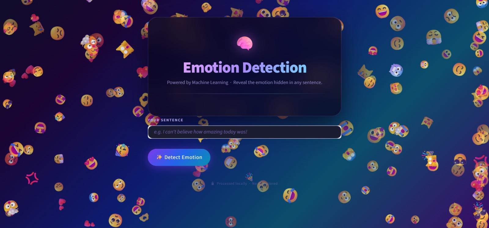
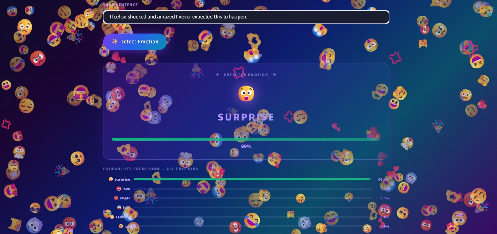

<div align="center">

# 🧠 Emotion Detection from Text

**Detect the emotion hidden in any sentence — powered by a LinearSVC machine learning model with calibrated confidence scores and a live floating emoji rain background.**

[](https://emotion-detection-from-text-6obwvzmfujmjgskstwp6tg.streamlit.app/)
[](https://www.python.org/)
[](https://scikit-learn.org/)
[](https://streamlit.io/)
[](LICENSE)

</div>

---

## 📸 Screenshots

| Home Screen | Prediction Result |
|:-----------:|:-----------------:|
|  |  |

---

## ✨ Features

| Feature | Description |
|---------|-------------|
| 🎯 **Emotion Prediction** | Enter any sentence and instantly detect its underlying emotion |
| 📊 **Confidence Score** | Animated progress bar showing model certainty per prediction |
| 📦 **Batch Mode** | Upload a CSV and predict emotions for thousands of rows at once |
| 📈 **Prediction History** | Session-level dashboard tracking all your predictions |
| 🔬 **Model Comparison** | Live comparison of LinearSVC vs Logistic Regression vs Naive Bayes |
| 🌌 **Dark Glass UI** | Frosted-glass card design with animated floating emoji rain background |
| ⚙️ **Auto-Training** | Model trains automatically on first run if `.pkl` files are missing |
| 🔒 **Privacy First** | All processing happens locally — no data is stored or sent externally |

---

## 📊 Model Performance

| Metric | Value |
|--------|:-----:|
| Algorithm | LinearSVC → CalibratedClassifierCV |
| Vectorizer | TF-IDF · 1–2 word n-grams · 50k features |
| Training Samples | 16,000 |
| Validation Samples | 2,000 |
| Test Samples | 2,000 |
| **Validation Accuracy** | **~90.90%** ✅ |
| **Test Accuracy** | **~89.90%** ✅ |

### Per-Class Performance (Test Set)

| Emotion | Precision | Recall | F1-Score | Support |
|---------|:---------:|:------:|:--------:|:-------:|
| 😡 anger | ~0.90 | ~0.89 | ~0.90 | 275 |
| 😨 fear | ~0.88 | ~0.87 | ~0.87 | 224 |
| 😄 joy | ~0.92 | ~0.93 | ~0.92 | 695 |
| 😍 love | ~0.76 | ~0.81 | ~0.78 | 159 |
| 😢 sadness | ~0.94 | ~0.94 | ~0.94 | 581 |
| 😲 surprise | ~0.74 | ~0.65 | ~0.69 | 66 |
| **Overall** | **~0.90** | **~0.90** | **~0.90** | **2000** |

> **LinearSVC** wrapped in `CalibratedClassifierCV` was chosen for higher accuracy and native probability output. It outperformed Logistic Regression and Naive Bayes by ~1–3% on this dataset.

---

## 🏗️ Architecture

```
User Input Text
       │
       ▼
  Preprocessing
  ┌─────────────────────────────────────┐
  │  Lowercase  →  Remove Punctuation   │
  │         →  Remove Stopwords         │
  └─────────────────────────────────────┘
       │
       ▼
  TF-IDF Vectorization
  (1–2 word n-grams, max 50,000 features)
       │
       ▼
  LinearSVC + CalibratedClassifierCV
       │
       ├──▶  Predicted Emotion Label  (e.g. "joy")
       └──▶  Confidence Score         (e.g. 87%)
```

| Layer | Technology |
|-------|-----------|
| Frontend | Streamlit + Custom CSS (glassmorphism dark theme) |
| Background | Vanilla JS emoji rain via `streamlit.components` |
| ML Model | LinearSVC → CalibratedClassifierCV (scikit-learn) |
| Vectorizer | TF-IDF (1–2 n-grams, max 50,000 features) |
| Preprocessing | NLTK stopwords + lowercase + punctuation removal |

---

## 💡 Detectable Emotions

| Emotion | Emoji | Training Samples |
|---------|:-----:|:----------------:|
| Joy | 😄 | 5,362 |
| Sadness | 😢 | 4,666 |
| Anger | 😡 | 2,159 |
| Fear | 😨 | 1,937 |
| Love | 😍 | 1,304 |
| Surprise | 😲 | 572 |

---

## 📁 Project Structure

```
Emotion-Detection-from-Text/
│
├── app.py                              # Main Streamlit app
├── emotion_detection_pipeline.ipynb   # EDA + model training notebook
│
├── train.txt                          # Training dataset     (16,000 samples)
├── val.txt                            # Validation dataset   (2,000 samples)
├── test.txt                           # Test dataset         (2,000 samples)
│
├── model.pkl                          # Serialized model      (auto-generated)
├── vectorizer.pkl                     # Serialized vectorizer (auto-generated)
├── val_accuracy.txt                   # Cached val accuracy   (auto-generated)
│
├── requirements.txt
├── .gitignore
│
└── screenshots/
    ├── app_home.jpeg
    └── app_prediction.jpeg
```

---

## 🚀 Quick Start

### 1. Clone the repository
```bash
git clone https://github.com/kananiisha/Emotion-Detection-from-Text.git
cd Emotion-Detection-from-Text
```

### 2. Create a virtual environment
```bash
python -m venv .venv

# Windows
.\.venv\Scripts\Activate.ps1

# macOS / Linux
source .venv/bin/activate
```

### 3. Install dependencies
```bash
pip install -r requirements.txt
```

### 4. Download NLTK stopwords *(one-time only)*
```python
import nltk
nltk.download('stopwords')
```

### 5. Run the app
```bash
streamlit run app.py
```

Open the local URL shown in your terminal. On first run the model trains automatically using `train.txt` and evaluates on `val.txt` — accuracy is then shown in the sidebar.

---

## 📓 Notebook

`emotion_detection_pipeline.ipynb` walks through the full ML workflow:

1. **EDA** — class distribution, text length analysis, word clouds
2. **Preprocessing** — lowercase, punctuation removal, stopword filtering
3. **Feature Engineering** — TF-IDF with bigrams
4. **Model Training & Comparison** — LinearSVC vs Logistic Regression vs Naive Bayes
5. **Evaluation** — accuracy, F1-score, confusion matrix
6. **Inference** — live prediction examples with confidence breakdown
7. **Findings & Next Steps** — limitations and improvement ideas

---

## 📦 Dependencies

```
streamlit>=1.32.0
pandas>=2.0.0
numpy>=1.26.0
scikit-learn>=1.4.0
nltk>=3.8.0
matplotlib>=3.8.0
seaborn>=0.13.0
```

---

## 📝 Notes

- `model.pkl`, `vectorizer.pkl`, and `val_accuracy.txt` are **gitignored** — they are regenerated automatically on first run.
- `prediction_history.csv` is also gitignored — it exists only at runtime and is cleared via the History tab.
- The `.gitignore` also excludes `.venv/`, `__pycache__/`, and common IDE files.

---

## 🤝 Contributing

1. Fork the repo
2. Create a feature branch — `git checkout -b feature/your-feature`
3. Commit your changes — `git commit -m "Add your feature"`
4. Push — `git push origin feature/your-feature`
5. Open a Pull Request

---

## 📄 License

[MIT License](LICENSE) — free to use and modify.

---

<div align="center">

**Built with ❤️ using Streamlit + LinearSVC**

[🌐 Live Demo](https://emotion-detection-from-text-6obwvzmfujmjgskstwp6tg.streamlit.app/) &nbsp;·&nbsp; [📓 Notebook](emotion_detection_pipeline.ipynb) &nbsp;·&nbsp; [🐛 Issues](https://github.com/kananiisha/Emotion-Detection-from-Text/issues)

</div>
